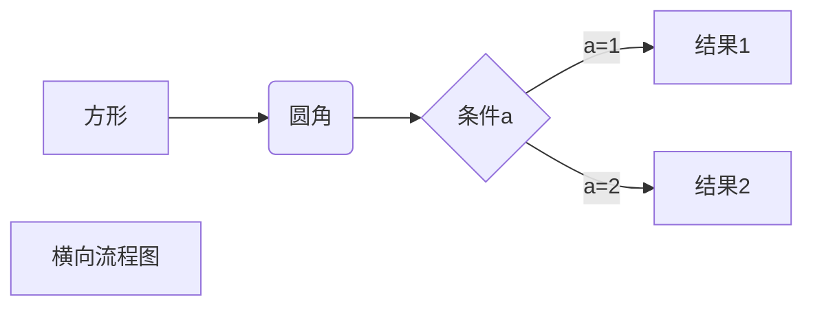


- [在 Hexo 中使用思维导图](https://hunterx.xyz/use-mindmap-in-hexo.html)
  - 前言
  - 操作指南
    - 准备需要的文件
    - 为主题添加 CSS/JS 文件
  - 使用方法


11
mermaid
graph LR
A[方形] -->B(圆角)
    B --> C{条件a}
    C -->|a=1| D[结果1]
    C -->|a=2| E[结果2]
    F[横向流程图]

