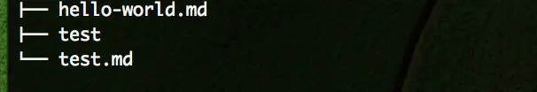
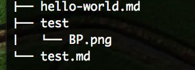
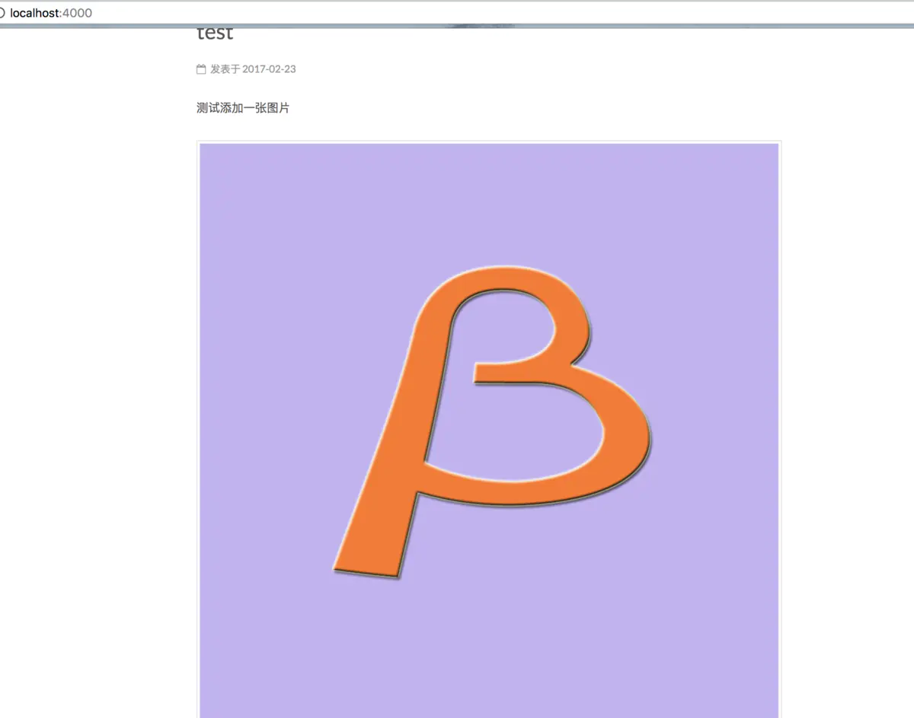

hexo使用及如何添加图片
<!--more-->

1、cd到博客根目录下 查看_config.yml文件 查找 post_asset_folder 字段确定post_asset_folder 设置为true -> post_asset_folder:true

2、当您设置 post_asset_folder 参数后，在建立文件时，Hexo 会自动建立一个与文章同名的文件夹，您可以把与该文章相关的所有资源都放到此文件夹内，这样就可以更方便的使用资源。

3、到博客的根目录下执行以下命令来进行插件的安装。

```
npm install https://github.com/CodeFalling/hexo-asset-image --save
```

4、然后创建一文章 hexo new "test" 然后查看博客的 ../source/_posts 目录下的文件，会看到存在一个test 文件夹 和 test.md 文件



5、将所需要的图片资源放到test 文件夹 内 目录结构如下：


6、书写文章使用test文件内 的图片


7、使用hexo s 命令运行本地博客如图

 
8、使用hexo clean hexo g hexo deploy 将本地博客推送到远程，即可看到文章中的图片。
✅Done！

9、看效果不是很满意，图片居中，很丑。需html语法让图片居左。由于编译器给img加了margin:0 auto，还是会居中，需在设置一下style

```

```

作者：iOS收藏家
链接：https://www.jianshu.com/p/8d28027fec76
</div>

