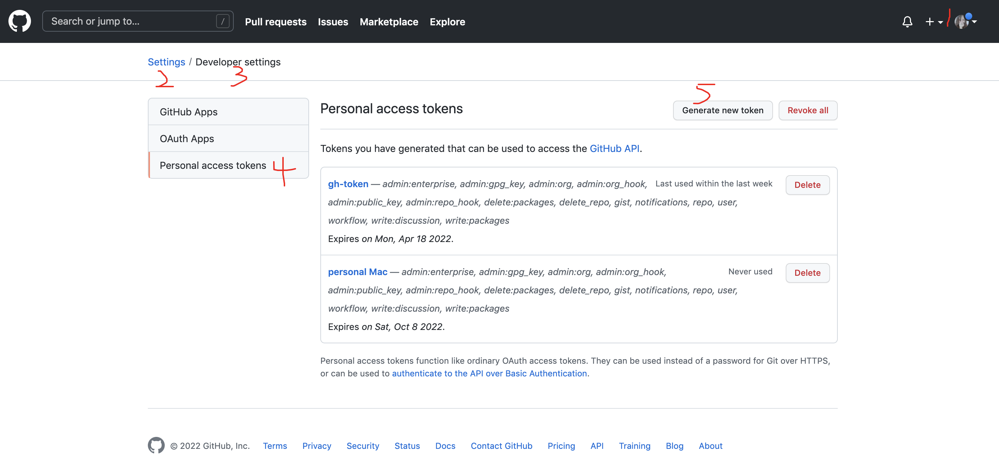
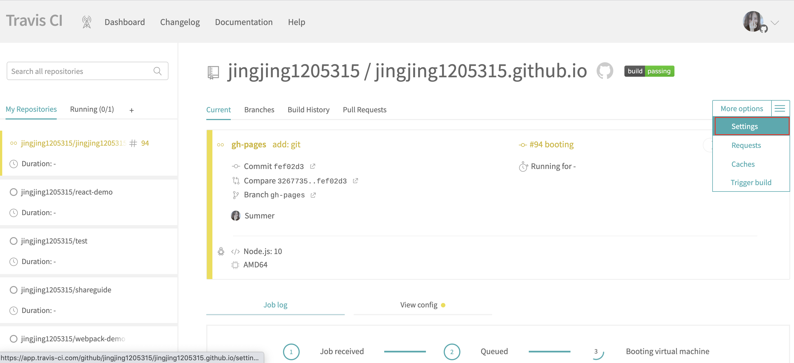
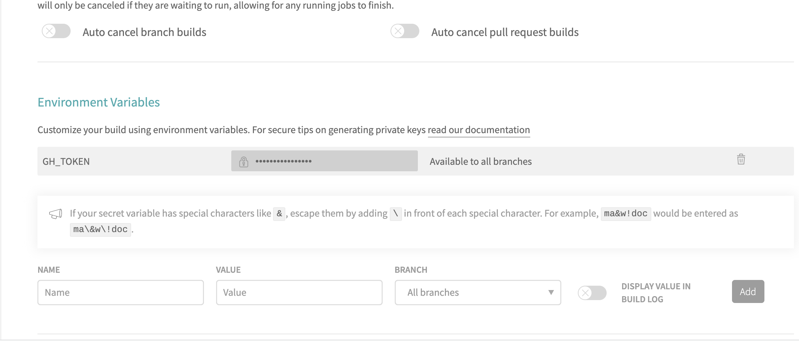

hexo和travis建github.io个人博客

<!--more-->

2021年9月份github处于安全考虑，需定期更新token。才能保证travis构建成功
1. github生成新token，只勾选repo。复制新token。



2. 将token设为为[travis](https://app.travis-ci.com/)中key为GH_TOKEN的environment variable。


--------------------------------------------------------

## 建name.github.io 仓库(开源)
可以自行百度，相关文章很多
## 安装hexo
[官方文档](https://hexo.io/zh-cn/docs/) 
### 安装前提
安装 Hexo 相当简单，只需要先安装下列应用程序即可：

Node.js (Node.js 版本需不低于 8.10，建议使用 Node.js 10.0 及以上版本)
Git

### 安装 Hexo
```
$ npm install -g hexo-cli
```
安装 Hexo 完成后，请执行下列命令，Hexo 将会在指定文件夹中新建所需要的文件。
```
$ hexo init <folder>
$ cd <folder>
$ npm install
```

新建完成后，指定文件夹的目录如下：
```
.
├── _config.yml
├── package.json
├── scaffolds
├── source
|   ├── _drafts
|   └── _posts
└── themes
```
### 配置_config.yml
```
title: April的个人小站
subtitle: ''
description: ''
keywords:
author: April
language: zh_CN
timezone: ''

# URL
## If your site is put in a subdirectory, set url as 'http://yoursite.com/child' and root as '/child/'
url: http://yoursite.com
root: /
permalink: :year/:month/:day/:title/
permalink_defaults:
pretty_urls:
  trailing_index: true # Set to false to remove trailing 'index.html' from permalinks
  trailing_html: true # Set to false to remove trailing '.html' from permalinks

# Directory
source_dir: source
public_dir: public
tag_dir: tags
archive_dir: archives
category_dir: categories
code_dir: downloads/code
i18n_dir: :lang
skip_render:

# Writing
new_post_name: :title.md # File name of new posts
default_layout: post
titlecase: false # Transform title into titlecase
external_link:
  enable: true # Open external links in new tab
  field: site # Apply to the whole site
  exclude: ''
filename_case: 0
render_drafts: false
post_asset_folder: false
relative_link: false
future: true
highlight:
  enable: true
  line_number: true
  auto_detect: false
  tab_replace: ''
  wrap: true
  hljs: false

# Home page setting
# path: Root path for your blogs index page. (default = '')
# per_page: Posts displayed per page. (0 = disable pagination)
# order_by: Posts order. (Order by date descending by default)
index_generator:
  path: ''
  per_page: 10
  order_by: -date

# Category & Tag
default_category: uncategorized
category_map:
tag_map:

# Metadata elements
## https://developer.mozilla.org/en-US/docs/Web/HTML/Element/meta
meta_generator: true

# Date / Time format
## Hexo uses Moment.js to parse and display date
## You can customize the date format as defined in
## http://momentjs.com/docs/#/displaying/format/
date_format: YYYY-MM-DD
time_format: HH:mm:ss
## Use post's date for updated date unless set in front-matter
use_date_for_updated: false

# Pagination
## Set per_page to 0 to disable pagination
per_page: 10
pagination_dir: page

# Include / Exclude file(s)
## include:/exclude: options only apply to the 'source/' folder
include:
exclude:
ignore:

# Extensions
## Plugins: https://hexo.io/plugins/
## Themes: https://hexo.io/themes/
theme: next1

# Deployment
## Docs: https://hexo.io/docs/deployment.html
deploy:
  type: git
  repo: https://github.com/jingjing1205315/jingjing1205315.github.io.git
  branch: master

```

## 安装travis-ci
[官网](https://www.travis-ci.org/getting_started) 点点点就好了。
## 将 Hexo 部署到 GitHub Pages(配置io库时，官方文档有误)
[官方文档](https://hexo.io/zh-cn/docs/github-pages)
从第8条开始有误，第10条中后缀为io的库不可以修改GitHub Pages 的部署分支为 gh-pages。以至于我们需要将源代码提交到gh-pages，travis-ci将push的代码构建成html放到master。
这时就要修改以下几条
8. 在你的 Hexo 站点文件夹中新建一个 .travis.yml 文件：
```
sudo: false
language: node_js
node_js:
  - 10 # use nodejs v10 LTS
cache: npm
before_install:               # install 阶段之前执行
  - npm install -g hexo-cli   # 全局安装 Hexo 命令行工具

install:                      # 在安装项目环境阶段需要运行的命令，一条一行，类似的还有 before_install
  - npm install               # 安装 package.json 中的依赖

script:                       # 在构建阶段需要运行的命令，一条一行，类似的还有 before_script、after_script
  - hexo clean
  - hexo generate             # Hexo 常规命令，执行清理和生成

branches:
  only:
    - gh-pages # build gh-pages branch only


deploy:
  provider: pages
  skip-cleanup: true
  github-token: $GH_TOKEN
  keep-history: true
  on:
    branch: gh-pages
  local-dir: public
  target-branch: master
```
9. 将 .travis.yml 推送到 repository 中的gh-pages分支，Travis CI 应该会自动开始运行，并将生成的文件推送到同一 repository 下的 master 分支下
<u>10. 在 GitHub 中前往你的 repository 的设置页面，修改 GitHub Pages 的部署分支为 gh-pages。</u> (非io仓库可以)
11. 前往 https://<你的 GitHub 用户名>.github.io 查看你的站点是否可以访问。这可能需要一些时间。

## 遇到的坑
### 给博客换主题
[官网](https://hexo.io/themes/),下载自己喜欢的主题。以next主题为例。

将_config.yml中的theme设置成下载的主题，本地运行没有问题，但是push到gh—pages时，就会发现themes下的next文件夹一直是空的。这时因为next主题有自己的.git。形成了git的submodule。

删掉.git，push，还是空的。

然后……  给next文件夹改个名字，如next1，可以push了……

这时_config.yml中的theme需要设置为next1，push，构建成功！

```

# Include / Exclude file(s)
## include:/exclude: options only apply to the 'source/' folder
include:
exclude:
ignore:

# Extensions
## Plugins: https://hexo.io/plugins/
## Themes: https://hexo.io/themes/
theme: next1 // 下载的主题，要改个名字

# Deployment
## Docs: https://hexo.io/docs/deployment.html
deploy:
  type: git
  repo: https://github.com/jingjing1205315/jingjing1205315.github.io.git
  branch: master

```