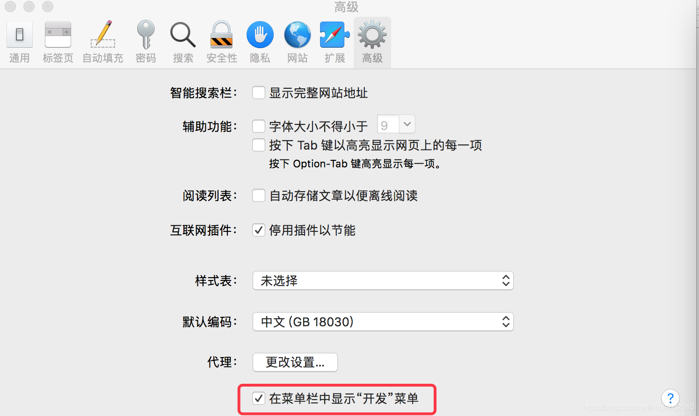
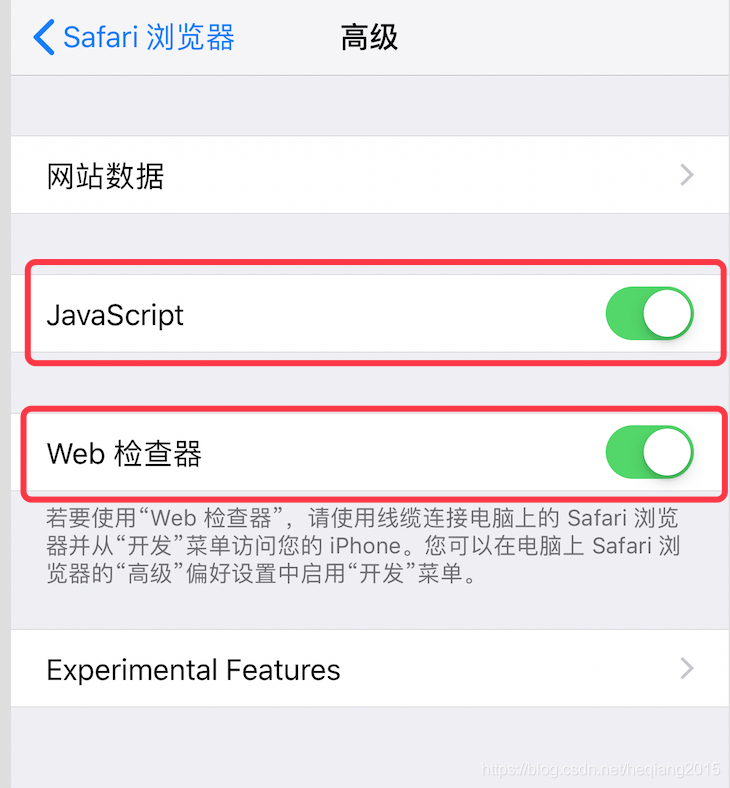
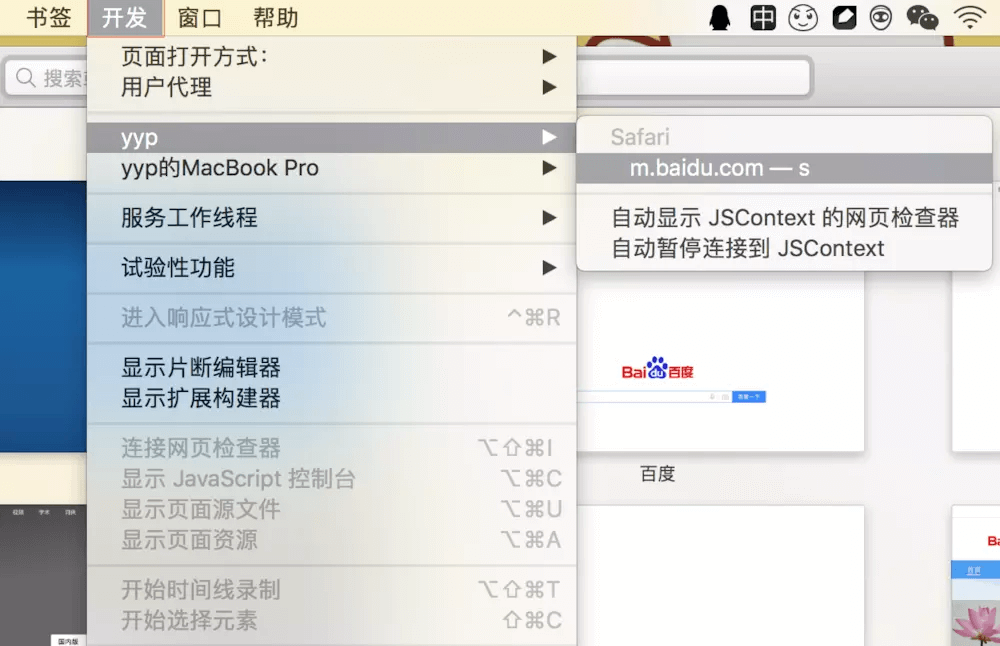

 ios手机和Safari真机调试
<!--more-->

### 准备工作：
Mac电脑，iPhone手机，数据线

### 1、mac中Safari设置：
打开Safari偏好者设置，选中“高级菜单”，将页面最下方的“在菜单中显示开发菜单”复选框打钩，这样设置完毕后就能在Safari菜单中看到开发菜单

### 2、iPhone 设置：
打开iPhone手机设置——>选择Safari，找到高级选项，有JavaScript开关、web检查器开关，将两个开关打开

### 3、iPhone连接mac上，打开Safari浏览器，运行App（开发版）或者手机Safari的web页面，在开发菜单中选择连接的手机，找到调试的网页，就能在Safari里面调试

4、定位问题出现区域的布局和样式

扩展： Chrome调试 Android web页面
1、安装Chrome浏览器
2、使用Android 真机连接电脑
3、最后，打开Chrome ,输入：chrome://inspect
https://blog.csdn.net/whh181/article/details/77930870

参考原文：
[Safari 调试iPhone web页面（App为开发版）](https://blog.csdn.net/heqiang2015/article/details/83991986)
[chrome实现pc端调试-移动端调试（Android）](https://blog.csdn.net/longlc123/article/details/56370004?utm_medium=distribute.pc_feed_404.none-task-blog-BlogCommendFromBaidu-1.nonecase&depth_1-utm_source=distribute.pc_feed_404.none-task-blog-BlogCommendFromBaidu-1.nonecas)

