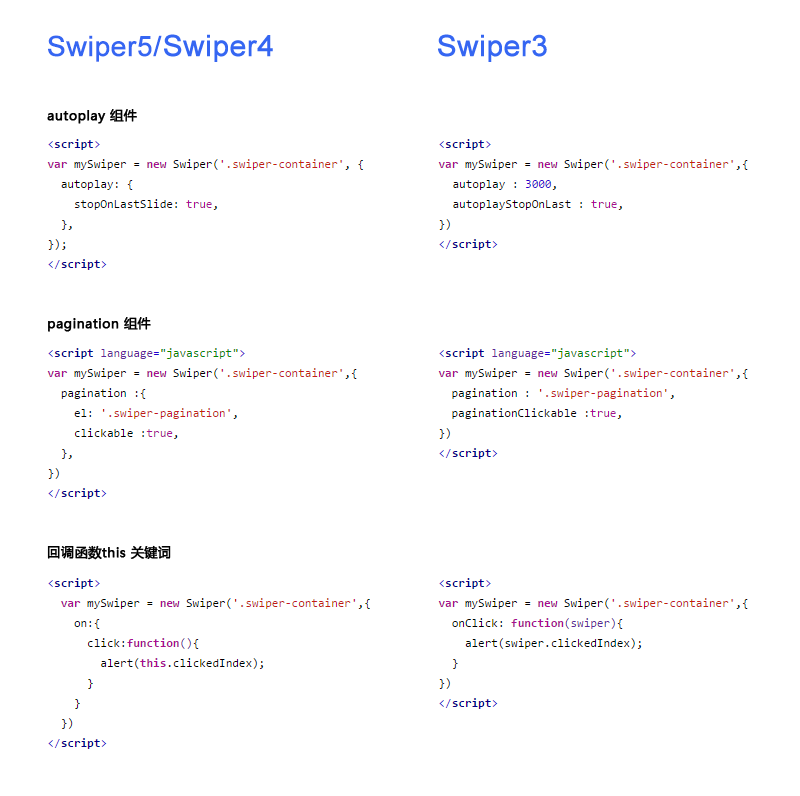

2020年的最后一天，就用来记录下这些日子来使用npm包遇到的坑。给自己加深下记忆。
<!--more-->

### vue-infinite-scroll无限加载

#### 安装

```
npm install vue-infinite-scroll --save
```

#### 使用（vue中）
##### 全局

```
import infiniteScroll from 'vue-infinite-scroll'
Vue.use(infiniteScroll)
```
##### 或者在组件中directive引入

##### 代码中片段

```
<div v-infinite-scroll="loadMore" infinite-scroll-disabled="busy" infinite-scroll-distance="10">
    <div v-for="item in data" :key="item.index">{{item.name}}</div>
</div>
```

```
data () {
    return {
      count: 0,
      data: [],
      busy: false
    }
  }
```

```
methods: {
    loadMore: function() {
      this.busy = true
      setTimeout(() => {
        for (var i = 0, j = 10; i < j; i++) {
          this.data.push({name: this.count++ })
        }
        console.log(this.data)
        this.busy = false
      }, 1000)
    }
  }
```

v-infinite-scroll="loadMore"表示回调函数是loadMore
infinite-scroll-disabled="busy"表示由变量busy决定是否执行loadMore，false则执行loadMore，true则不执行，看清楚，busy表示繁忙，繁忙的时候是不执行的。
infinite-scroll-distance="10"这里10决定了页面滚动到离页尾多少像素的时候触发回调函数，10是像素值。通常我们会在页尾做一个几十像素高的“正在加载中...”，这样的话，可以把这个div的高度设为infinite-scroll-distance的值即可。

其他选项：

infinite-scroll-immediate-check 默认值为true，该指令意思是，应该在绑定后立即检查busy的值和是否滚动到底。如果你的初始内容高度不够高、不足以填满可滚动的容器的话，你应设为true，这样会立即执行一次loadMore，会帮你填充一些初始内容。
infinite-scroll-listen-for-event 当事件在Vue实例中发出时，无限滚动将再次检查。
infinite-scroll-throttle-delay 检查busy的值的时间间隔，默认值是200，因为vue-infinite-scroll的基础原理就是，vue-infinite-scroll会循环检查busy的值，以及是否滚动到底，只有当：busy为false且滚动到底，回调函数才会执行。

#### 我遇到的坑

承载v-infinite-scroll="loadMore" infinite-scroll-disabled="busy" infinite-scroll-distance="10"的元素上有个***v-if***，导致loadMore根本就不会执行，这块一定要特别注意

### swiper 轮播图

引用，以下或者cdn

```
//CommonJs
var Swiper = require('swiper');    
var mySwiper = new Swiper('.swiper-container', { /* ... */ });

//ES
import Swiper from 'swiper';    
var mySwiper = new Swiper('.swiper-container', { /* ... */ });
```

html

```
<div class="swiper-container">
    <div class="swiper-wrapper">
        <div class="swiper-slide">Slide 1</div>
        <div class="swiper-slide">Slide 2</div>
        <div class="swiper-slide">Slide 3</div>
    </div>
    <!-- 如果需要分页器 -->
    <div class="swiper-pagination"></div>
    
    <!-- 如果需要导航按钮 -->
    <div class="swiper-button-prev"></div>
    <div class="swiper-button-next"></div>
    
    <!-- 如果需要滚动条 -->
    <div class="swiper-scrollbar"></div>
</div>
导航等组件可以放在container之外
```

初始化

```

<script>        
  var mySwiper = new Swiper ('.swiper-container', {
    direction: 'vertical', // 垂直切换选项
    loop: true, // 循环模式选项
    
    // 如果需要分页器
    pagination: {
      el: '.swiper-pagination',
    },
    
    // 如果需要前进后退按钮
    navigation: {
      nextEl: '.swiper-button-next',
      prevEl: '.swiper-button-prev',
    },
    
    // 如果需要滚动条
    scrollbar: {
      el: '.swiper-scrollbar',
    },
  })        
  </script>
 
```

#### 不同版本API变化



#### swiper6

```
import Swiper, { Autoplay, Pagination } from "swiper";
Swiper.use([Autoplay, Pagination]);
import "swiper/swiper-bundle.min.css";

```
```
new Swiper(".swiper-container", {
                initialSlide: 2,
                speed: 300,
                autoplay: {
                    delay: 3000,
                },
                loop: true,
                slidesPerView: 3,
                spaceBetween: '6%',
                centeredSlides: true,
                // pagination: {
                //     el: ".swiper-pagination",
                //     clickable: true,
                // },
            });
```


#### 使用文档API
[使用文档API](https://www.swiper.com.cn/api/index.html)

#### 使用swiper遇到的坑
不同的版本调用不用api，巨坑！
一定要注意版本！一定要注意版本！！一定要注意版本！！！

