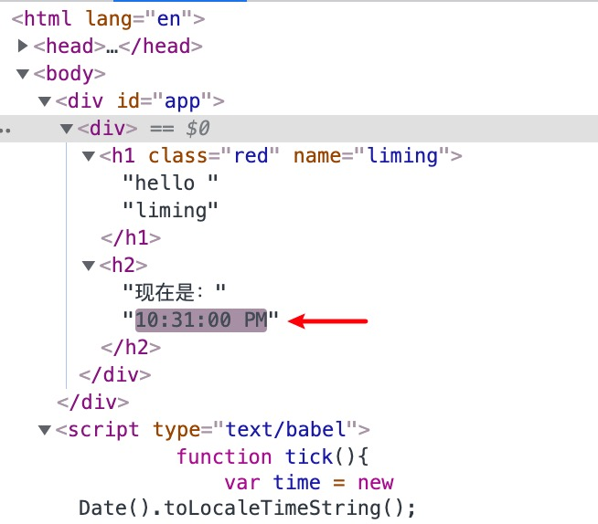
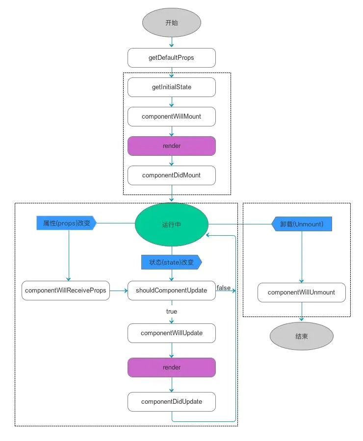

react入门学习，来自bilibili腾讯课堂

<!--more-->

# react入门
## 可以做什么
pc/h5 App  小程序（京东程序编译）
## 使用版本
react16.12.0
react-router^5.12.0
## 特色
函数组件和hooks

## 环境准备

### Node安装使用
nodejs 是基于chrome v8引擎的JavaScript运行环境
#### 前端开发环境
webpack  npm插件  server
#### 服务端动态编程语言
写接口、链接数据库、Node web

#### node黑盒

```
node
```
就进入node的编程环境

### npm 使用

```
npm adduser | npm publish // 发布一个包，登录后发布
npm config set registry https://registry.npmjs.org/ // npm真正的地址
npm config set registry  https://registry.npm.taobao.org/ // 下载包地址换位淘宝映射
npm unpublish[包名] --force // 删除包
```

### yarn使用
#### yarn概念
前端包管理器，去npm平台下载包
速度快，更安全，更可靠

```
npm install yarn -g
npm upgrade yarn -g
```
#### yarn使用

```
yarn -v
yarn init
yarn install
yarn add/remove // 对应npm install 包名
yarn publish/login/logout
yarn run 
```

# react介绍
## 特性
声明式 组件化 灵活
组件化：侧重UI层
模块化：侧重功能
单/多页面 服务端渲染 RN-App
## 编写Hello world
### CDN
#### react核心库
建议加crossorigin，同时建议验证使用的 CDN 是否设置了 Access-Control-Allow-Origin: * HTTP 请求头：

```
<script crossorigin src="https://unpkg.com/react@16/umd/react.development.js"></script> // 开发环境
<script crossorigin src="https://unpkg.com/react@17/umd/react.production.min.js"></script> // 生成环境
```

#### reactDOM

```
<script crossorigin src="https://unpkg.com/react-dom@16/umd/react-dom.development.js"></script>  // 开发环境
<script crossorigin src="https://unpkg.com/react-dom@17/umd/react-dom.production.min.js"></script> // 生成环境
```

```
yarn add react react-dom --save //将核心库和reactDOM下载到本地，直接引入本地node包中的文件
<script crossorigin src="./node_modules/react/umd/react.development.js"></script> 
<script crossorigin src="./node_modules/react/umd/react.production.min.js"></script> 

```
#### babel 解析ES6语法 解析jsx

```
<script crossorigin src="https://unpkg.com/babel-standalone@6/babel.min.js"></script>  
```
### 核心语法

```
reactDom.render()
react.creatElement()
react.components()
```

### react核心语法应用

```
<div id="app"></div>
<script>
    var hello = React.createElement('h1', {
        className: 'red',
        name: 'liming',
    }, 'hello world');
    ReactDOM.render(hello, document.getElementById('app'));
</script>
```
## JSX介绍
JSX， 一种 JavaScript 的语法扩展。元素是构成 React 应用的最小单位，JSX 就是用来声明 React 当中的元素。 在js中编写html代码

- 添加自定义属性需要使用 data- 前缀。

- 在 JSX 中不能使用 if else 语句，但可以使用 conditional (三元运算) 表达式来替代

- 注释需要写在花括号中

- JSX 允许在模板中插入数组，数组会自动展开所有成员：

- 一些标识符像 class 和 for 不建议作为 XML 属性名。作为替代，React DOM 使用 className 和 htmlFor 来做对应的属性。

```
<script crossorigin src="https://unpkg.com/babel-standalone@6/babel.min.js"></script>  // 增加babel解析
```

```
<div id="app"></div>
<script type="text/babel"> // script 必须定义类型
    var name = 'liming';
    ReactDOM.render(
        <h1 className="red" name="liming">hello {name}</h1>, // html语法可以直接卸载render里
        document.getElementById('app'));
</script>
```

## 元素渲染
model

```
<div id="app"></div>
<script type="text/babel">
    function tick(){
        var time = new Date().toLocaleTimeString();
        var name = 'liming';
        var dom = <div> // 多个标签时一定要有根元素
                <h1 className="red" name="liming">hello {name}</h1>
                <h2>现在是：{time}</h2>
            </div>
        ReactDOM.render(
            dom,
            document.getElementById('app'));
    }
    setInterval(tick, 1000);
    
</script>
```
view
可以在html结构中看到，有差异才渲染，变动的只有：


## 组件和props
### React.createClass(); // 废弃，笨重，不灵活
### 函数式组件（无状态组件）

```
<script type="text/babel">
    function Hello(props){ // 函数式组件，无生命周期
        return <div>
                <h1 className="red">hello {props.name}</h1>
                <h2>现在是：{props.time}</h2>
            </div>
    }
    
    ReactDOM.render(
        <Hello time="晚上" name='LiMing' />,
        document.getElementById('app'));
</script>
```
### React.Component

```
<script type="text/babel">
    class Hello extends React.Component{ // 正常组件，有生命周期
        render(){
            return <div>
                <h1 className="red">hello { this.props.name}</h1>
                <h2>现在是：{ this.props.time}</h2>
            </div>
        }
    }
    ReactDOM.render(
        <Hello time="晚上" name='LiMing' />,
        document.getElementById('app'));
</script>
```

## React生命周期
执行过程，四个阶段：
组件初始化阶段
组件加载阶段
组件更新阶段
组件销毁阶段



## 初始化和加载阶段

```
<script type="text/babel">        
    class Hello extends React.Component{ // 正常组件，有生命周期
        constructor(props){
            console.log('初始化阶段')
            // 初始化props
            super(props)
            // 初始化状态
            this.state = {
                name: 'Liming',
                time: '晚上'
            }
        }
        componentWillMount(){
            console.log('组件加载前')
        }
        componentDidMount(){
            console.log('组件加载后')
        }
        
        render(){
            console.log('组件加载或组件更新')
            return <div>
                <h1 className="red">hello { this.state.name}</h1>
                <h2>现在是：{ this.state.time}</h2>
                <button onClick={this.updateUser} >更新</button>
            </div>
        }
    }
    ReactDOM.render(
        <Hello time="晚上" name='LiMing' />,
        document.getElementById('app'));
</script>
```
打印顺序

```
初始化阶段constructor
组件加载前componentWillMount
组件加载或组件更新render
组件加载后componentDidMount
```
## 更新阶段
```
<script type="text/babel">        
    class Hello extends React.Component{ // 正常组件，有生命周期
        constructor(props){
            console.log('初始化阶段')
            // 初始化props
            super(props)
            // 初始化状态
            this.state = {
                name: 'Liming',
                time: '晚上'
            }
        }
        componentWillMount(){
            console.log('组件加载前')
        }
        componentDidMount(){
            console.log('组件加载后')
        }
        updateUser = () => { // 需用箭头函数 或updateUser = function() {} 不然this指向undefined
            // this.state.name = 'Tim'; // 错误，不会触发render
            this.setState({
                name: 'Tim'
            })
        }
        shouldComponentUpdate(){
            return true; // true 代表需要更新 false代表不更新
        }
        componentWillUpdate(){
            console.log('组件将要更新')
        }
        componentDidUpdate(){
            console.log('组件已经更新')
        }
        render(){
            console.log('组件加载或组件更新')
            return <div>
                <h1 className="red">hello { this.state.name}</h1>
                <h2>现在是：{ this.state.time}</h2>
                <button onClick={this.updateUser} >更新</button> // onClick后的函数并一定不要加()
            </div>
        }
    }
    ReactDOM.render(
        <Hello time="晚上" name='LiMing' />,
        document.getElementById('app'));
</script>
```

```
数据是否需要更新shouldComponentUpdate
组件将要更新componentWillUpdate
组件加载或组件更新render
组件已经更新componentDidUpdate
```
## 事件处理

react组件中普通的方法中的this指向undefined 可以用箭头函数

```
updateUser () { 
    console.log(this) // undefined
    this.setState({
        name: 'Tim'
    })
}
```
但还是想用这种写法的话

```
<script type="text/babel">        
    class Hello extends React.Component{ // 正常组件，有生命周期
        constructor(props){
            console.log('初始化阶段')
            // 初始化props
            super(props)
            // 初始化状态
            this.state = {
                name: 'Liming',
                time: '晚上'
            }
            this.updateUser = this.updateUser.bind(this); // 给自己定义事件绑定this
        }
        
        updateUser () { // react组件中普通的方法中的this指向undefined 可以用箭头函数
            console.log(this) // 组件实例
            this.setState({
                name: 'Tim'
            })
        }
        
        render(){
            console.log('组件加载或组件更新')
            return <div>
                <h1 className="red">hello { this.state.name}</h1>
                <h2>现在是：{ this.state.time}</h2>
                <button onClick={this.updateUser} >更新</button>
            </div>
        }
    }
    ReactDOM.render(
        <Hello time="晚上" name='LiMing' />,
        document.getElementById('app'));
</script>
```

或者修改点击事件

```
<button onClick={() => this.updateUser()} >更新</button>
或
<button onClick={this.updateUser.bind(this)} >更新</button>
```
## 条件判断
通过if else或者三目判断出应用的组件，再把组件放到应用的位置

```
<script type="text/babel">        
    function Login(props){
        return <button onClick={props.updateUser}>登录</button>
    }
    function Logout(props){
        return <button onClick={props.updateUser}>登出</button>
    }
    class Hello extends React.Component{ // 正常组件，有生命周期
        state = {
            name: 'LiMing',
            isLogin: false
        }
        updateUser = ()=> { // react组件中普通的方法中的this指向undefined 可以用箭头函数
            this.setState({
                isLogin: !this.state.isLogin
            })
        }
        
        render(){
            const {isLogin} = this.state;
            let button;
            if(isLogin){ // 条件判断button为登录还是登出，也可用三目
                button = <Login updateUser={this.updateUser}/> // 向子组件传递自定义事件，子组件可通过出发传递的事件来修改父组件的state
            }else{
                button = <Logout updateUser={this.updateUser}/>
            }
            return <div>
                <h1 className="red">hello { this.state.name}</h1>
                {button}
            </div>
        }
    }
    ReactDOM.render(
        <Hello time="晚上" name='LiMing' />,
        document.getElementById('app'));
</script>
```
## 列表渲染
将[1,2,3,4,5]转化为[<li key="0">1</li>, <li key="1">2</li>,....]，将转化后的数组放在相应的位置

```
<script type="text/babel">        
    class List extends React.Component{ // 正常组件，有生命周期
        state = {
            list: [1,2,3,4,5],
        }
        render(){
            const { list } = this.state;
            return <ul>
                {list.map((item, i) => <li key={i}>{item}</li>)}
            </ul>
        }
    }
    ReactDOM.render(
        <List  />,
        document.getElementById('app'));
</script>
```

## 表单应用
需要在表单数据修改onChange，主动更新state中的value，

```
this.setState({
    val: event.target.value
})
```

```
<script type="text/babel">        
    class TodoList extends React.Component{ // 正常组件，有生命周期
        state = {
            val: '',
            list: [],
        }
        changeHandler = (event)=>{
            this.setState({
                val: event.target.value
            })
            // this.state.val = event.target.value; // 直接赋值input框的输入都输不进去
        }
        add = ()=>{

            this.state.list.push(this.state.val);
            this.setState({
                list: this.state.list
            })
        }
        render(){
            const { val, list } = this.state;
            return <div>
                <input type="text" value={val} onChange={this.changeHandler} />
                <button onClick={this.add} >添加</button>
                <ul>
                    {list.map((item, i) => <li key={i}>{item}</li>)}
                </ul>
            </div>
        }
    }
    ReactDOM.render(
        <TodoList  />,
        document.getElementById('app'));
</script>
```
