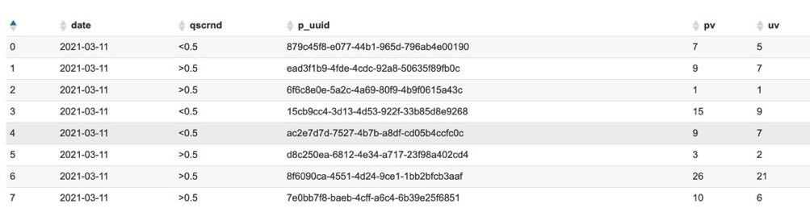

作为前端，可能认为数据层是后端的需要处理的事情。但现在是大数据时代，往往需要我们在页面中埋点来记录分析用户行为。我们如何检验我们的埋点是否埋上、埋对，就需要我们具有基础数据查询能力。

<!--more-->

###基础查询
select 列名,列名,列名,列名,列名
from 表名
where 条件
and 条件
or 条件

```
select date, user_id, distinct_id 
from
events
where date >= '2021-03-01'
and event='H5PageView'
and filename='H5_WA_PaymentSuccess'
```
### limit 条数
假如不限制条数，查询的数据特别多的话，会非常慢，limit来限制返回多少条符合结果的数据

```
select date, user_id, distinct_id,project_uuid
from
events
where date >= '2021-03-01'
and event='H5PageView'
and filename='H5_WA_PaymentSuccess'
limit 10
```

### group by 列名
将查询结果按**(列名)分组

```
select date
from
events
where date >= '2021-03-01'
and event='H5PageView'
and filename='H5_WA_PaymentSuccess'
group by date

```
### distinct 列名
根据列名去重

```
select date, distinct user_id
from
events
where date >= '2021-03-01'
and event='H5PageView'
and filename='H5_WA_PaymentSuccess'
group by date

```
### as (列名 as 自己起的名字)
为列名起个别名

```
select date as '日期', distinct user_id
from
events
where date >= '2021-03-01'
and event='H5PageView'
and filename='H5_WA_PaymentSuccess'
group by date

```
### order by 列名
根据日期这一列来排序，可选择升序asc，和降序desc

```
select date as '日期', distinct user_id
from
events
where date >= '2021-03-01'
and event='H5PageView'
and filename='H5_WA_PaymentSuccess'
order by date desc

```

### count(列名) 
根据列名统计总数，也可以用count(*)

```
select date as '日期', count(distinct user_id)
from
events
where date >= '2021-03-01'
and event='H5PageView'
and filename='H5_WA_PaymentSuccess'
group by date desc

```
### 函数
不同的数据库支持的函数不同。下面所用函数为[impala提供](https://impala.apache.org/docs/build/html/topics/impala_functions.html)

Impala Mathematical Functions--数学方法
Impala Type Conversion Functions--转换方法
Impala Date and Time Functions--日期和事件方法
Impala Conditional Functions--条件方法
Impala String Functions--字符串方法
Impala Aggregate Functions--聚合方法
Impala Analytic Functions--分析方法
Impala Bit Functions--二进制方法
Impala Miscellaneous Functions--混杂方法

如下
cast( *** as DECIMAL(9,8)) 将***转换为数字，精度为9，小数位为8

GET_JSON_OBJECT(字符串形式的json, '$.key值') 将字符串形式的json转换为json，并取json中的这个key值。

replace(原始字符串, '要被替换的字符串', '替换的字符串') 替换字符串

parse_url(原始url, 'QUERY') --第二个参数可选值'PROTOCOL', 'HOST', 'PATH', 'REF', 'AUTHORITY', 'FILE', 'USERINFO', or 'QUERY'
第二个参数是'QUERY'，还可以有第三个参数parse_url(原始url, 'QUERY', 'url参数的key')

```
select date,
 cast(GET_JSON_OBJECT(REPLACE(ExtraInfo, '\\', ''),'$.qscrnd') as DECIMAL(9,8)) as qscrnd ,
 parse_url(origin_url, 'QUERY', 'projuuid') as project_uuid 
from
events
where date >= '2021-03-01'
and event='H5PageView'
and filename='H5_WA_PaymentSuccess'
order by date
```

### 主表 join 副表 on 以**提交件

结合两张表来查询，也可以结合两个查询结果来查询。
### case when 条件 then 输出 end
整合条件

```
select pv.date,
case 
   when pv.qscrnd < 0.5 
   then '<0.5'
   when pv.qscrnd >= 0.5 
   then '>0.5'
end as qscrnd,

count(*) as pv, 
count(distinct pv.user_id) as uv

from (
    select date, user_id, distinct_id,project_uuid,
      cast(GET_JSON_OBJECT(REPLACE(ExtraInfo, '\\', ''),'$.qscrnd') as DECIMAL(9,8)) as qscrnd 
    from
    events
    where date >= '2021-03-01'
    and event='H5PageView'
    and filename='H5_WA_PaymentSuccess'
    --and filevalue='H5_WA_PaymentSuccess'
  ) pv 
  
  join (
    select user_id, distinct_id,project_uuid
    from
    events
    where date >= '2021-03-01'
    and event = 'FileClick'
    and filename='Button_RedPocket'
    and filevalue='H5_WA_PaymentSuccess'
  ) click
  on pv.user_id = click.user_id
  --and pv.project_uuid = click.project_uuid

group by date, qscrnd
order by date desc
```



