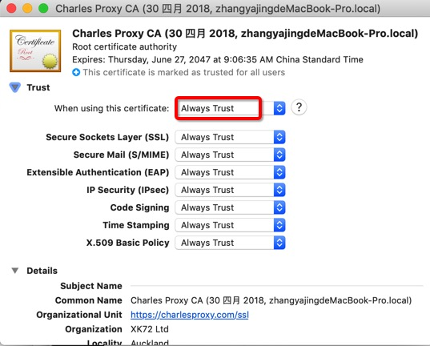
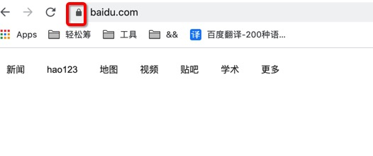

nginx的https证书配置
<!--more-->

### 创建密钥
首先，进入 nginx 配置目录，创建 openssl 配置文件 **req.conf**，其中的 CN, DNS.1, DNS.2 等需要替换为自己的域名：

```
[req]
distinguished_name = req_distinguished_name
x509_extensions = v3_req
prompt = no
[req_distinguished_name]
C = US
ST = VA
L = SomeCity
O = MyCompany
OU = MyDivision
CN = www.company.com
[v3_req]
keyUsage = keyEncipherment, dataEncipherment
extendedKeyUsage = serverAuth
subjectAltName = @alt_names
[alt_names]
DNS.1 = www.company.net
DNS.2 = company.com
DNS.3 = company.net
```

如果域名较多，且都隶属于同一个主域名，可以将 DNS.1、DNS.2 等简化为 *.example.com。即：

```
...
[alt_names]
DNS.1 = *.example.com
```
接着，执行如下命令，创建证书：

```
openssl req -x509 -nodes -days 730 -newkey rsa:2048 -keyout cert.pem -out cert.pem -config req.conf -extensions 'v3_req'
```
### 配置 nginx

```
server {
    listen 443 ssl;
    server_name www.example.com;
    ssl_certificate cert.pem;
    ssl_certificate_key cert.pem;
    location / {
        root /Users/example/hello/world;
        index index.html index.htm;
    }
}
```
服务器证书（ssl_certificate）是一个公开文件，每个请求连接的客户端都会收到一份。私有密钥（ssl_certificate_key）是加密单元，需要存储在保密的地方，但要确保 nginx 主线程可访问。私有密钥一般和证书存储到同一位置。

cert.pem 就是上一个步骤产生的证书和密钥，在一个文件中。

### 配置浏览器
打开 Chrome 的开发者工具下的【security】选项卡，查看当前的证书，然后下载下来，双击添加到操作系统中，修改为始终信任就可以了。

### 采坑
1、mac-keychain Access 找到对应的证书改为 Always Trust



2、如果钥匙串中没有相应证书，找到nginx中配置的证书，双击添加到钥匙串中。

2、由于我是在原证书中加了一个域名，重新生成的证书，发现刷新、重启浏览器、删除老证书，都不能让本地起的nginx服务变安全。解决方法是重启nginx。配置成功！



### 转载自
[设置本地 nginx 的 HTTPS](https://www.1zh.tech/2017/12/15/setup-local-https/)

