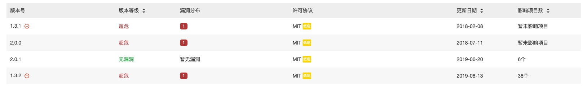

安全越来越受到大家的重视。在网络安全方面，我们前端可以做些什么呢？

<!-- more -->

# NodeJS包漏洞
    gulp-cli依赖的mixin-deep包的漏洞检测情况
    
    在这种情况下，我们可以固定版本来解决漏洞。问题在于mixin-deep并不是我们的直接依赖。把直接依赖升级到最高版本，依然不能解决。
    yarn的packege.json有个resolution字段。可以帮助我们解决这个问题。npm可以通过npm-force-resolution库来实现。

    ```
    "resolutions" : {
        "set-value": "4.1.0",
        "mixin-deep": "2.0.1"
    }
    ```
    但比这个更严重的，是作者故意投毒。[如何看待 node-ipc 包以反战为名进行供应链投毒？](https://www.zhihu.com/question/522144107)
    而我们能做什么呢？任重道远~
    提高安全意识，用 docker、虚拟机、wsl等隔离环境进行开发
    fork node-ipc，解除所有依赖
[node_modules 困境](https://zhuanlan.zhihu.com/p/137535779)
# XSS 跨站脚本攻击
跨站脚本攻击(Cross Site Scripting)的简写，为了不与层叠样式表混淆而改写的
## 反射性XSS
暂时性。将input框中输入直接将输入写入到页面中展示。普通文案会正常展示，若为script代码'<script>alert(0)</script>'，则会执行该代码，弹窗alert框。这种攻击类型也可以执行其他恶意代码。

## 存储性XSS
永久性。将input框中输入写入数据库。再从数据库取出数据使用时，都会遭到恶意脚本的攻击。同样是'<script>alert(0)</script>'，每次使用页面都会弹窗，阻塞其他用户使用，影响较大。

## DOM XSS
document.location、request.url、document.URL、document.referrer  或其他任何攻击者可以修改的浏览器对象获取数据,在未验证数据是否存在恶意代码的情况下，应用程序将易于受到基于DOM的XSS攻击。

获取cookie、token、sessionID，劫持会话。
## XSS 漏洞防范
### 输入
1) 输入做转义，如'<script>alert(0)</script>'转为'$lt;script$gt;alert(0)$lt;/script$gt'；

2) 输入做过滤, input输入仅限数字、字母等；

### 输出
使用innerHTML输出内容到DOM

new Function(**)与eval出入的参数，都是易受攻击的。
[什么是XSS攻击？](https://zhuanlan.zhihu.com/p/37913950)
[常见的Web漏洞——XSS](https://blog.csdn.net/qq_32261191/article/details/80959103)
[XSS攻击的解决方法](https://www.cnblogs.com/lovesong/p/5223989.html)
[跨站脚本漏洞(XSS)基础讲解](https://www.jianshu.com/p/4fcb4b411a66)
# 
